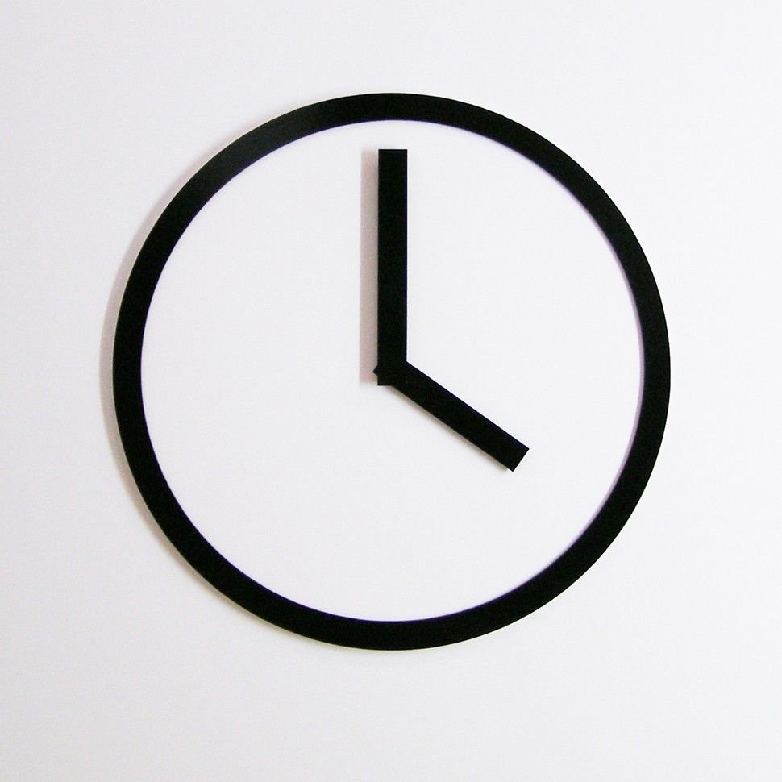
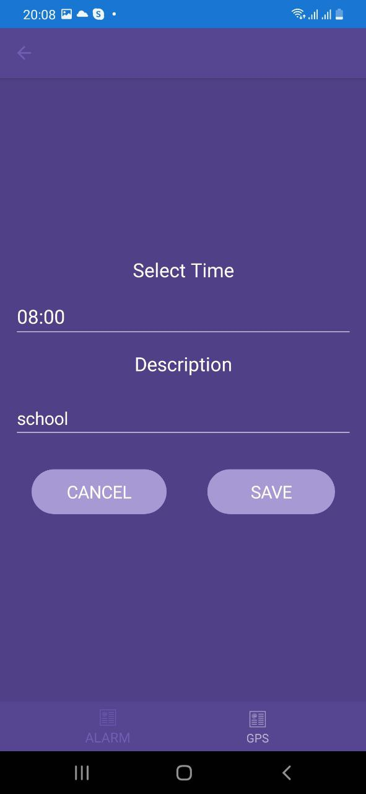
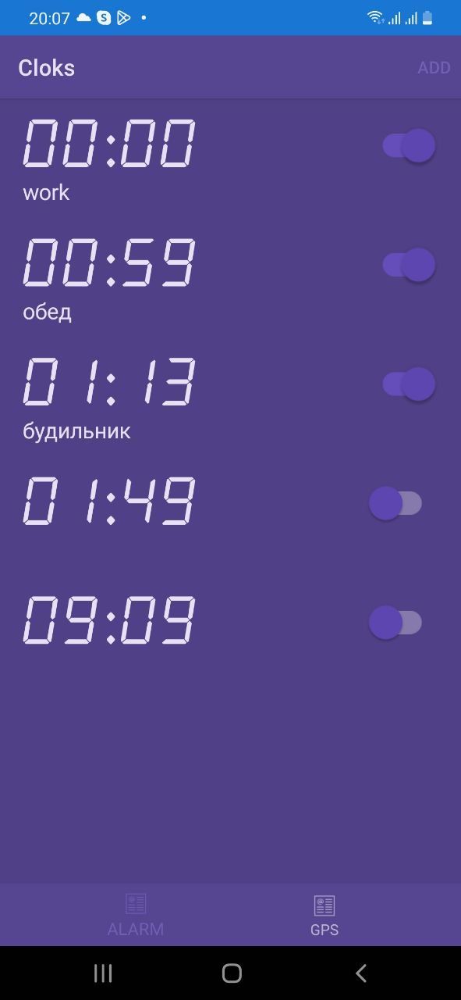
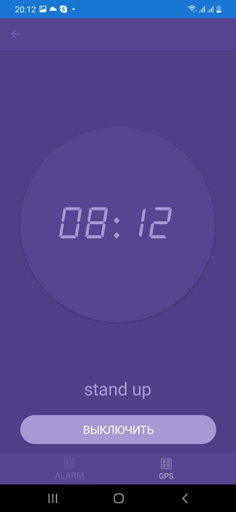
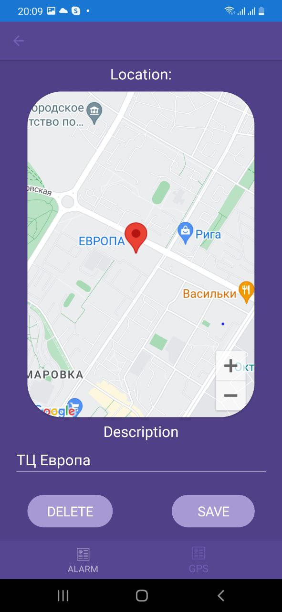
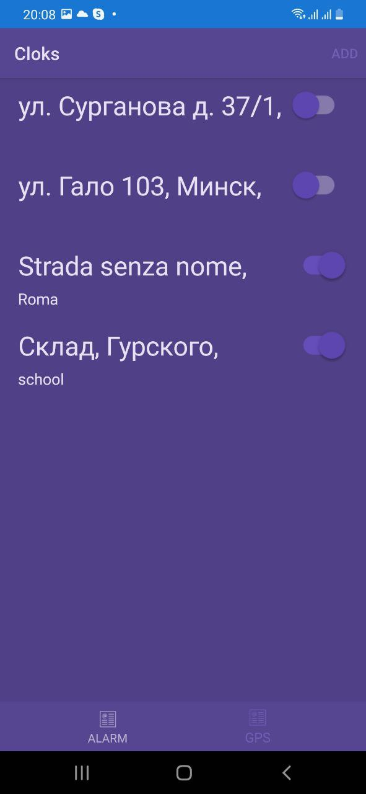
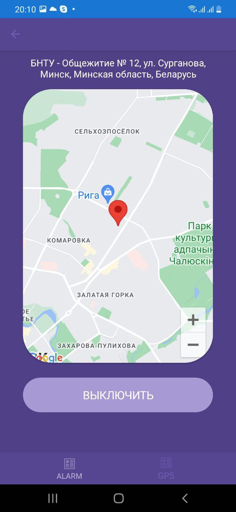

<p align="center">
      
</p>
<p align="center">
   
   
   
</p>

## About
GPS Alarm Clock is an innovative application that combines the functionalities of a traditional alarm clock with the added convenience of a GPS-based alarm system. Users can set a traditional time-based alarm or set a GPS-based alarm by placing a marker on a map. The GPS alarm will trigger when the user arrives at the specified location.

## Demo
<p>Alarm</p>
<p align="center">
  
  
  
</p>
<p>GPS Alarm</p>
<p align="center">
  
  
  
</p>

## Project Features

 - Set traditional time-based alarms with customizable settings.
 - Place markers on a map to set GPS-based alarms that trigger when you reach the location.
 - User-friendly interface for easy management of both types of alarms.
 - Customizable alarm settings to suit various user needs.

## Technologies

 - Programming Language: C# 8.0
 - UI Design: XAML
 - Architectural Pattern: MVVM (Model-View-ViewModel)
 - Object-Oriented Programming (OOP)
 - SOLID Principles

## Installation

1. Clone the repository:
   ```sh
   git clone https://github.com/your-username/gps-alarm-clock.git

## Developers
- [daanicccch](https://github.com/daanicccch)
